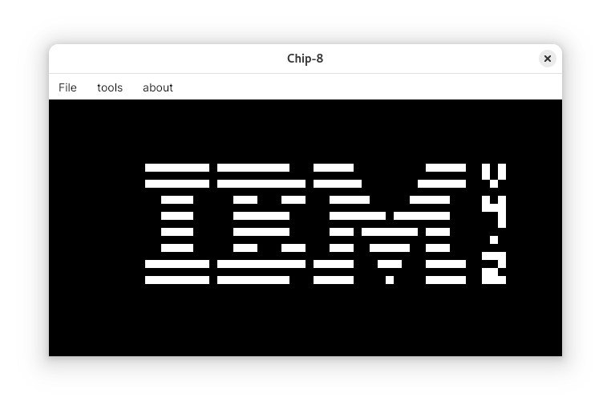

# C# Chip8 emulator (OpenTK, Avalonia)

### Keypad

`1-1` `2-2` `3-3` `4-C`

`Q-4` `W-5` `E-6` `R-D`

`A-7` `S-8` `D-9` `F-E`

`Z-A` `X-0` `C-B` `V-F`

left - keyboard, right - original keypad

`O` restarts the emulator
`P` pauses the emulator

### Resources

- [Tobiasvl's blog](https://tobiasvl.github.io/blog/write-a-chip-8-emulator/) - most info about the emulator and how to
  implement it comes from here
- [Cowgod's technical reference](http://devernay.free.fr/hacks/chip8/C8TECH10.HTM) - used as reference for all the
  instructions (some descriptions don't satisfy the emulation quirks)
- [Timendus test suite](https://github.com/Timendus/chip8-test-suite/tree/main) - very useful to check if the emulator
  is running as intended
- [Avalonia OpenTK example](https://github.com/DigitalBox98/Avalonia-OpenTK-Sample) - how to integrate Avalonia UI with OpenTK
- [Chip8 roms](https://github.com/kripod/chip8-roms) - various roms for the emulator
