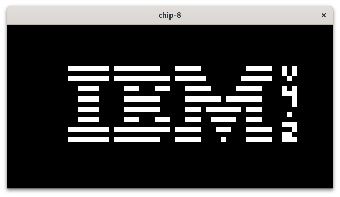

### Settings

The settings.json file is used to set the rom, colors and beep sound

```Json
{
    "rom_path": "roms/Brick.ch8",
    "bg_color": [0.0, 0.0, 0.0],
    "pixel_color": [1.0, 1.0, 1.0],
    "beep_sound": "assets/beep.wav"
}
```

### Keypad

`1-1` `2-2` `3-3` `4-C`

`Q-4` `W-5` `E-6` `R-D`

`A-7` `S-8` `D-9` `F-E`

`Z-A` `X-0` `C-B` `V-F`

left - keyboard, right - original keypad

`P` restarts the emulator


### Resources

- [Tobiasvl's blog](https://tobiasvl.github.io/blog/write-a-chip-8-emulator/) - most info about the emulator and how to implement it comes from here
- [Cowgod's technical reference](http://devernay.free.fr/hacks/chip8/C8TECH10.HTM) - used as reference for all the instructions (some descriptions don't satisfy the emulation quirks)
- [Timendus test suite](https://github.com/Timendus/chip8-test-suite/tree/main) - very useful to check if the emulator is running as intended